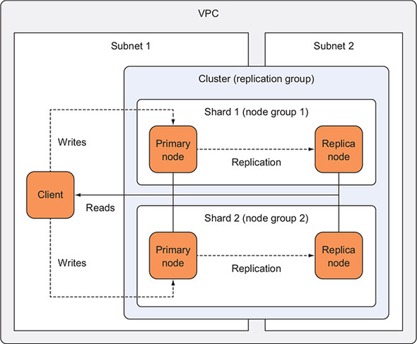

# Redis Deployment through AWS service broker

The current choice of defaults for the Elastic cache redis deployment is driven largely by the following factors:

1) Backup/Restore: Can I backup or restore the data from the cache?
2) In the event a single node fails, can I still gaurantee the durability of data?
3) Sharding: If the data is large enough to fit on a single node, can I add more nodes to increase capacity?

A Redis cluster with cluster mode enabled supports backups, data replication, and sharding.A single redis cluster can have upto 15 shards. Each shard consists of one primary and upto five replica nodes. Doing the math, the largest cluster size possible in a single redis deployment is 90 nodes.



### Service Instance Parameter Description:

`CacheNodeType`: The instance type the nodes will launch under. For production traffic, select a cache node type with atleast 2 vCPUs and have enough memory to hold the data.

`MultiAZSupport`: Indicates whether Multi-AZ is enabled. When Multi-AZ is enabled, a read-only replica is automatically promoted to a read-write primary cluster if the existing primary cluster fails. This should be set to true for cluster mode enabled redis deployment

`NumNodeGroups`: Specifies the number of node groups (shards) for this Redis (cluster mode enabled) replication group. For Redis (cluster mode disabled) either omit this parameter or set it to 1. The current default in this cloudformation template is set to 2 to enable cluster mode by default

`ReplicasPerNodeGroup`: The number of cache clusters for this replication group. If MultiAZ support is enabled, you must specify a value greater than 1.

`RedisPort`: The port number on which each member of the replication group accepts connections. The default port is `6379`. This value should be unused port number and can be between `1` and `65535`.

`ReplicationGroupDescription`: Specify a replication group description for your deployment.

`VpcId`: This references a VPC onto which this redis cluster must be deployed. This is a `required` parameter.

`SnapshotRetentionLimit`: The number of days that ElastiCache retains automatic snapshots before deleting them. For an automatic snapshot, the number of days for which ElastiCache retains the snapshot before deleting it. If the value of SnapshotRetentionLimit is set to zero (0), backups are turned off.

`SnapshotWindow`: The time range (in UTC) when ElastiCache takes a daily snapshot of your node group. Please refer to the Cloudformation template for parameter specific constraints.

`PreferredMaintenanceWindow`: The weekly time range during which system maintenance can occur. Use the following format to specify a time range: ddd:hh24:mi-ddd:hh24:mi (24H Clock UTC).

`Subnet A`: One of the subnets you would like the ReplicationGroup to be created in. In this deployment we only accept 2 subnets(Subnet A and Subnet B) for now. This is a `required` parameter.

`Subnet B`: One of the subnets you would like the ReplicationGroup to be created in. In this deployment we only accept 2 subnets(Subnet A and Subnet B) for now. This is a `required` parameter.

`TransitEncryptionEnabled`: This ensures all the data in transit is secured throughout the redis deployment. By default it is set to true for the default deployment as per requirements.

`AtRestEncryptionEnabled`: This ensures all the data at rest is encrypted throughout the redis deployment. By default it is set to true for the current default deployment as per requirements.

`AuthToken`: Auth Token is a reserved parameter. Auth Token is the password used by the clients to access the redis server when authtoken is specified. Passwords must be only printable ASCII characters. Must be at least 16 characters and no more than 128 characters in length. For more password constraints information, see http://redis.io/commands/AUTH.

The cloudformation template defaults can be overridden by defining a service instance description as defined below.

### Sample Service Instance description:

```apiVersion: servicecatalog.k8s.io/v1beta1
kind: ServiceInstance
metadata:
  name: elasticcache-redis
  namespace: test-redis
spec:
  clusterServiceClassExternalName: rediscache
  clusterServicePlanExternalName: production
  parameters:
    VpcId: vpc-0f59e1f5e6fd508d5
    SubnetA: subnet-0e4181f08ff976280
    SubnetB: subnet-0d09eee389164464e
    TransitEncryptionEnabled: False
    AtRestEncryptionEnabled: False
```

## Connecting to the cluster

The cloudformation template outputs the configuration endpoint address and the configuration port. This can be used to connect to the cluster.

### Using the redis-cli 

1) Encryption in transit is disabled

    redis-cli -c -h <configuration endpoint address> -p <port> -a <auth token>

2) Encryption in transit is enabled

 The default redis-cli client doesn't support SSL. One way to access the cluster might be using a encrypted tunnel between the client and the server. Follow the documentation in https://docs.aws.amazon.com/AmazonElastiCache/latest/red-ug/in-transit-encryption.html to learn about accessing the cluster.

### Using language specific clients

    Java and Python clients already support SSL and can be used to connect to the cluster as well.